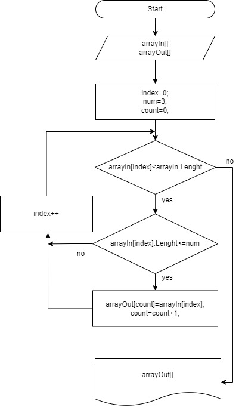

# Итоговая контрольная работа
## Задача 

```
Написать программу, которая из имеющегося массива строк формирует новый массив из строк, длина которых меньше, либо равна 3 символам. Первоначальный массив можно ввести с клавиатуры, либо задать на старте выполнения алгоритма. При решении не рекомендуется пользоваться коллекциями, лучше обойтись исключительно массивами.
```
Алгоритм решения:



1. Задаём два масиива. Первый заполняет пользователь, второй оставляем пустым.
2. Задаем цикл. Условием повторения: пока индекс элемента меньше длинны задонного массива
3. Внутри цикла создаем условие проверки длинны элемента массива (строки), если меньше или равно 3м записываем элемент в второй массив.
4. Как только индекс элемента заданного массива равен длинне массива выходим из цикла и выводим заполненный второй массив.


Программный код находиться в файле Program.cs